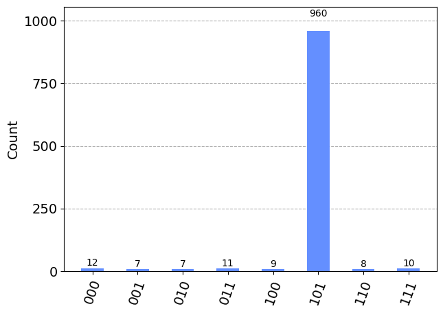

## Detailed Code Explanation

### grover_algorithm.py


## Abstract

Grover's Algorithm, a cornerstone in quantum computing, provides a significant speedup for searching unsorted databases compared to classical algorithms. This repository presents a detailed implementation of Grover's Algorithm using Qiskit, an open-source quantum computing framework. The implementation demonstrates the algorithm's ability to search a database quadratically faster than any classical counterpart, showcasing the potential of quantum computing in solving specific computational problems more efficiently.

## Introduction

Developed by Lov Grover in 1996, Grover's Algorithm is one of the most prominent algorithms in quantum computing. It is particularly known for its quadratic speedup in searching unsorted databases, a task that has linear complexity in the classical paradigm. This algorithm is a powerful illustration of the advantages of quantum computing, leveraging the principles of superposition and quantum entanglement.


#### Importing Modules
* QuantumCircuit: Used to create a circuit that holds the quantum operations.
* Aer: Provides access to Qiskit's high-performance quantum simulator.
* execute: A function to run the quantum circuit on a specified backend.
* plot_histogram: A utility for visualizing the probabilities of the outcomes.
* Statevector: (Not used in the code provided) Typically used for state preparation and simulation.
* GroverOperator: Constructs the Grover iteration, which includes the oracle and amplitude amplification (diffuser).
* ZGate: A quantum gate that applies a phase flip to the state of a qubit.
* Statevector: Typically used for state preparation and simulation.
```python
from qiskit.visualization import plot_histogram  
from qiskit import QuantumCircuit, Aer, execute  
from qiskit.quantum_info import Statevector  
from qiskit.circuit.library import GroverOperator, ZGate
```

#### Grover's Algorithms
* Initializes a quantum circuit for a specified number of qubits.
* Applies Hadamard gates to put qubits in superposition, preparing the equal superposition state necessary for Grover's algorithm.
* Creates a GroverOperator object that encapsulates the oracle and diffuser for use in Grover's algorithm.
* Determines the number of iterations needed to amplify the amplitude of the correct answer.
* Appends the Grover operator to the circuit for the calculated number of iterations.
* Adds measurement to all qubits in the circuit to observe the outcome.
```python
def grovers_algorithm(num_of_qubits, oracle):
    quantum_circuit = QuantumCircuit(num_of_qubits)
    quantum_circuit.h(range(num_of_qubits))

    grover_operator = GroverOperator(oracle, insert_barriers=True)
    num_of_iterations = round((3.14 / 4) * (2 ** (num_of_qubits / 2)))

    for _ in range(num_of_iterations):
        quantum_circuit.append(grover_operator, range(num_of_qubits))

    quantum_circuit.measure_all()
    return quantum_circuit
```

#### Oracle Function    
* Defines the oracle used in Grover's algorithm, which "marks" the correct answer by flipping its phase.
* Applies X-gates to qubits corresponding to '0' in the target state to prepare for a controlled phase flip.
* Appends a controlled-Z gate that applies a phase shift to the target state only.
* Applies X-gates again to revert the qubits to their original state.
```python
def oracle_for_marked_state(marked_state):
    oracle_circuit = QuantumCircuit(len(marked_state))

    for qubit, bit in enumerate(marked_state):
        if bit == '0':
            oracle_circuit.x(qubit)

    oracle_circuit.append(ZGate().control(len(marked_state) - 1), range(len(marked_state)))

    for qubit, bit in enumerate(marked_state):
        if bit == '0':
            oracle_circuit.x(qubit)

    return oracle_circuit
```

#### Main Execution
* Sets the number of qubits and defines the target state that Grover's algorithm will search for.
* Constructs the oracle based on the target state.
* Builds the quantum circuit for Grover's algorithm using the number of qubits and the oracle.
```python
number_of_qubits = 3
marked_state = '101'  
oracle = oracle_for_marked_state(marked_state)  
grover_circuit = grovers_algorithm(number_of_qubits, oracle)
```

#### Simulation and Visualization
* Chooses the Aer simulator as the backend for execution.
* Executes the Grover's algorithm circuit with a specified number of shots (1024), allowing for statistical sampling of the outcomes.
* Retrieves the counts of each outcome (how many times each possible measurement result was observed).
* Plots the histogram of the outcomes, showing the probability distribution across all possible states.
```python
quantum_simulator = Aer.get_backend('qasm_simulator')
simulation_result = execute(grover_circuit, quantum_simulator, shots=1024).result()
outcome_counts = simulation_result.get_counts(grover_circuit)
plot_histogram(outcome_counts)
```

#### Output Interpretation
The histogram plot indicates that the quantum simulator was run with 1024 shots. Each bar represents the measured outcomes for each possible state. The state '101', which the Grovers algorithm was set to find, has a significantly higher count (960) than all other states, demonstrating that the algorithm successfully amplified the probability of measuring the target state.

In the histogram, each state is shown with its corresponding count. The state '101' stands out with the highest count, indicating that the algorithm has successfully identified it as the marked state. The other states have counts significantly lower, consistent with the expected uniform distribution of the non-target states after the Grovers iterations.

This detailed explanation captures the essence of the code and the resulting output in the image, suitable for a README.md file that accompanies a software repository or a project submission.



